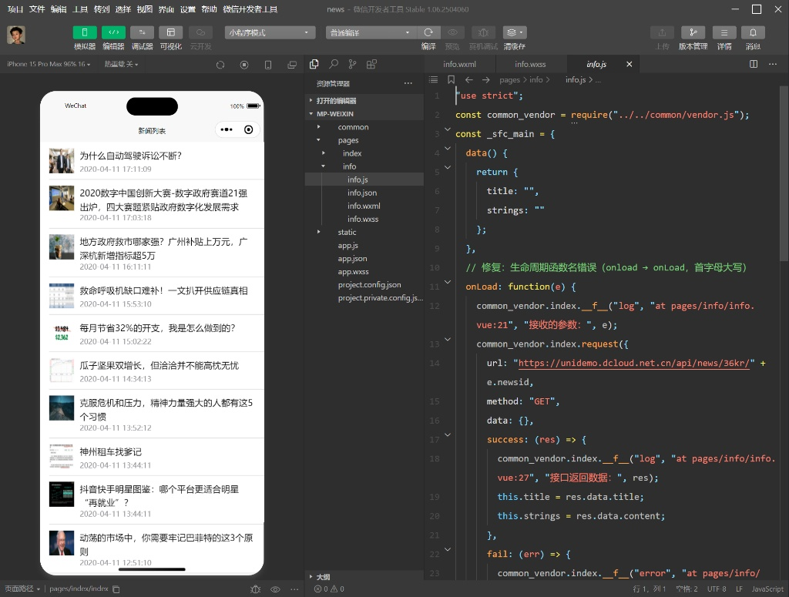

# 新闻资讯小程序

一个基于 uni-app 框架开发的新闻资讯类小程序应用，支持多平台发布（微信小程序、支付宝小程序、百度小程序、头条小程序等）。

## 项目简介

这是一个新闻资讯类应用，主要功能包括：
- 新闻列表展示
- 新闻详情查看
- 支持多种小程序平台
- 响应式设计适配

### 演示截图



> 上图展示了新闻资讯小程序的主要界面和功能

## 技术栈

- **前端框架**: uni-app (Vue.js 3.x)
- **开发语言**: JavaScript
- **样式**: CSS/SCSS
- **构建工具**: HBuilder X / uni-app CLI

## 项目结构

```
uni-app1/news/
├── common/                    # 公共工具类
│   ├── airport.js            # 机场相关工具
│   ├── graceChecker.js       # 表单验证工具
│   ├── html-parser.js        # HTML解析器
│   ├── permission.js         # 权限管理
│   ├── uni-nvue.css          # nvue样式
│   ├── uni.css               # 全局样式
│   └── util.js               # 工具函数
├── pages/                     # 页面目录
│   ├── index/                # 首页
│   │   └── index.vue         # 新闻列表页面
│   └── info/                 # 详情页
│       └── info.vue          # 新闻详情页面
├── static/                    # 静态资源
│   └── logo.png              # 应用logo
├── unpackage/                 # 打包输出目录
│   └── dist/                 # 编译后文件
├── App.vue                    # 应用入口文件
├── main.js                    # 应用主入口
├── manifest.json              # 应用配置文件
├── pages.json                 # 页面路由配置
├── uni.promisify.adaptor.js   # Promise适配器
└── uni.scss                   # 全局SCSS样式
```

## 功能特性

### 新闻列表页面 (pages/index/index)
- 展示新闻列表
- 支持图片懒加载
- 下拉刷新和上拉加载更多
- 点击新闻项跳转到详情页

### 新闻详情页面 (pages/info/info)
- 展示新闻详细内容
- 富文本内容渲染
- 支持图片查看

## 快速开始

### 环境要求
- HBuilder X (推荐) 或 VS Code + uni-app插件
- Node.js 14.x 或更高版本
- 微信开发者工具（微信小程序开发）

### 安装依赖
```bash
# 使用HBuilder X打开项目即可，无需额外安装依赖
```

### 开发运行

#### 使用HBuilder X
1. 打开HBuilder X
2. 导入项目文件夹 `uni-app1/news/`
3. 点击"运行"按钮选择目标平台

#### 使用命令行
```bash
# 安装uni-app CLI
npm install -g @dcloudio/uni-cli

# 运行到微信小程序
npm run dev:mp-weixin

# 运行到H5
npm run dev:h5

# 运行到App
npm run dev:app
```

### 构建发布

#### 微信小程序
```bash
npm run build:mp-weixin
```
构建完成后，使用微信开发者工具导入 `unpackage/dist/build/mp-weixin` 目录进行上传发布。

#### H5
```bash
npm run build:h5
```
构建完成后，部署 `unpackage/dist/build/h5` 目录到Web服务器。

#### App
```bash
npm run build:app
```
使用HBuilder X进行云打包或本地打包。

## API接口

本项目使用以下API接口获取新闻数据：

- **新闻列表**: `https://unidemo.dcloud.net.cn/api/news`
- **新闻详情**: `https://unidemo.dcloud.net.cn/api/news/36kr/{newsid}`

## 配置说明

### manifest.json
应用配置文件，包含：
- 应用基本信息（名称、版本、描述）
- 各平台特有配置（微信小程序、App、H5等）
- 权限配置（Android权限、iOS配置等）
- 模块配置和SDK配置

### pages.json
页面路由和窗口样式配置，包含：
- 页面路由配置
- 全局窗口样式
- 导航栏样式配置

## 开发规范

### 代码规范
- 使用ES6+语法
- 遵循Vue.js 3.x Composition API规范
- 组件命名使用PascalCase
- 方法命名使用camelCase

### 样式规范
- 使用rpx作为单位，适配不同屏幕尺寸
- 遵循移动端设计规范
- 保持样式模块化，避免全局污染

## 浏览器兼容性

- 微信小程序：基础库 2.0+
- H5：现代浏览器（Chrome 60+, Safari 12+, Firefox 60+）
- App：Android 5.0+, iOS 9.0+

## 贡献指南

1. Fork 项目
2. 创建特性分支 (`git checkout -b feature/amazing-feature`)
3. 提交更改 (`git commit -m 'Add some amazing feature'`)
4. 推送到分支 (`git push origin feature/amazing-feature`)
5. 创建 Pull Request

## 许可证

本项目基于 [MIT License](LICENSE) 开源协议。

## 联系方式

如有问题或建议，请通过以下方式联系：
- 邮箱：your-email@example.com
- 微信：your-wechat-id

## 更新日志

### v1.0.0 (2024-01-01)
- 初始版本发布
- 新闻列表和详情功能
- 多平台支持